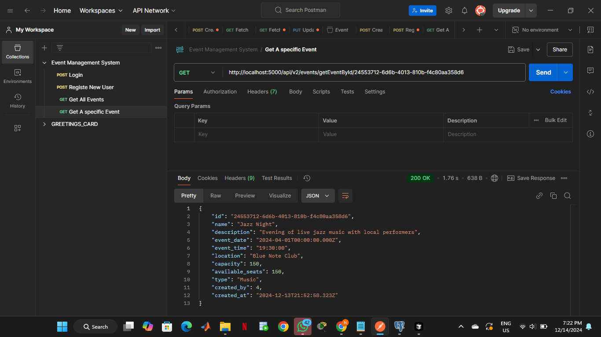
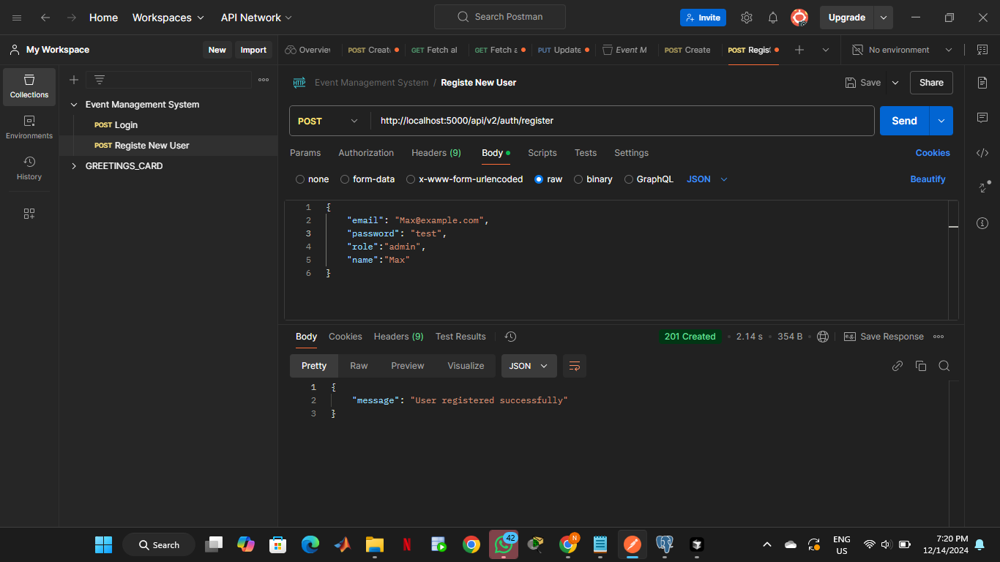
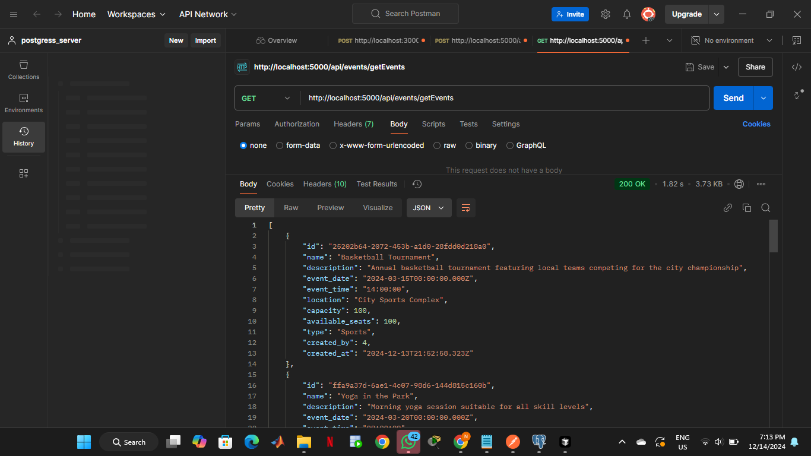
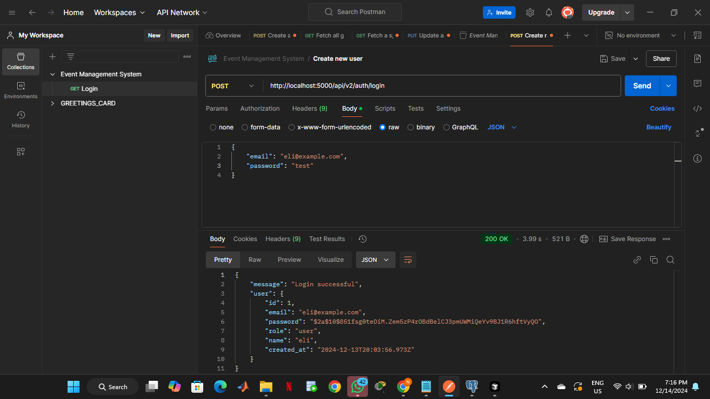

# Campus Event System - Backend

## Overview
This is the backend server for the Campus Event System, a web application designed to manage and coordinate campus events. The system provides functionality for event creation, user management, and event registration.

## Technologies Used
- Node.js
- Express.js
- PostgreSQL
- MongoDB
- JWT Authentication
- Nodemailer
- CORS

## Links

### Development Link
- Frontend: https://velvety-starship-094a60.netlify.app
- Backend: https://campus-management-systembackend.onrender.com
- Database Admin: http://localhost:8080/pgadmin (PostgreSQL)

## Prerequisites
- Node.js (v14 or higher)
- PostgreSQL or MongoDB database
- npm or yarn package manager

## Installation

1. Clone the repository

## Error Handling
The API uses standard HTTP response codes:
- 200: Success
- 400: Bad request
- 401: Unauthorized
- 403: Forbidden
- 404: Not found
- 500: Server error

## Security
- JWT-based authentication
- Password hashing using bcrypt
- CORS enabled
- Request validation using express-validator

## Contributing
1. Fork the repository
2. Create your feature branch (`git checkout -b feature/AmazingFeature`)
3. Commit your changes (`git commit -m 'Add some AmazingFeature'`)
4. Push to the branch (`git push origin feature/AmazingFeature`)
5. Open a Pull Request

## License
This project is licensed under the ISC License.

## Contact
Project Maintainer - Nate
Project Link: [Repository URL]

## Images

### API Documentation

Note: All images are stored in the `/postman/images` directory.